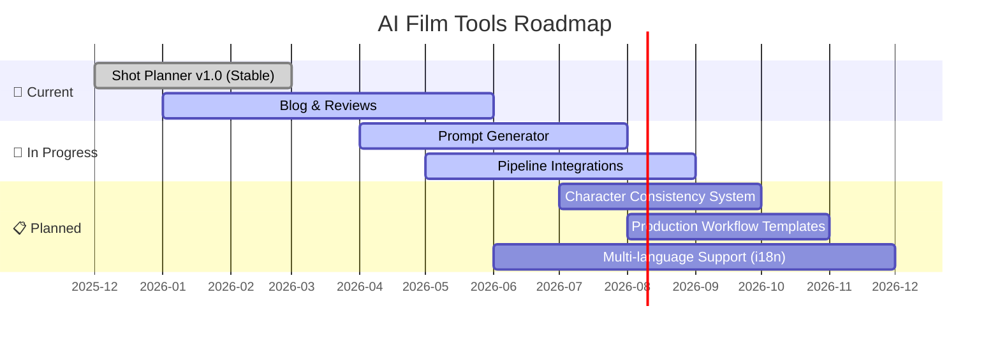

<div align="center">

# 🎬 AI Film Tools · 人工智能影视制作工具

> **Open-source AI tools for film production, shot planning, prompt engineering, and creative workflows**
> **开源人工智能影视制作工具集 —— 镜头规划、提示词工程与创意工作流**

[](https://github.com/zhanggengxi/ai-film-tools/releases)
[](LICENSE)
[]()
[](https://github.com/zhanggengxi/ai-film-tools)
[](https://zhanggengxi.github.io/ai-film-tools/)
[](CONTRIBUTING.md)

---

[🇺🇸 English](#-overview) · [🇨🇳 中文](#-概述) · [🇯🇵 日本語](#-coming-soon) · [🇰🇷 한국어](#-coming-soon) · [🇪🇸 Español](#-coming-soon)

---

</div>

<br>

---

## 🌟 Sponsorship · 赞助支持

<div align="center">
<br>

### ❤️ Support AI Film Tools · 支持 AI Film Tools

**Your support keeps these tools free and open-source for everyone!**
**你的支持让这些工具保持免费开源！**

<br>

<a href="https://github.com/sponsors/zhanggengxi">
  
</a>
&nbsp;&nbsp;
<a href="https://buymeacoffee.com/aifilmtools">
  
</a>
&nbsp;&nbsp;
<a href="https://afdian.net/a/xiaosimao">
  
</a>
&nbsp;&nbsp;
<a href="https://gengxi.gumroad.com">
  
</a>

<br><br>

| Platform · 平台 | Link · 链接 | Purpose · 用途 |
|:---------------:|:-----------:|:--------------:|
| 🌟 **GitHub Sponsors** | [github.com/sponsors/zhanggengxi](https://github.com/sponsors/zhanggengxi) | Monthly / one-time support · 月度/一次性赞助 |
| ☕ **Buy Me a Coffee** | [buymeacoffee.com/aifilmtools](https://buymeacoffee.com/aifilmtools) | One-time coffee · 请喝咖啡 ☕ |
| 💳 **Gumroad Store** | [gengxi.gumroad.com](https://gengxi.gumroad.com) | Premium prompt packs & workflows · 付费提示词包与工作流 |
| ⚡ **爱发电** | [afdian.net/a/xiaosimao](https://afdian.net/a/xiaosimao) | 国内赞助渠道 |
| 💰 **One-time via Stripe** | [Donate](https://github.com/sponsors/zhanggengxi) | Direct donation · 一次性捐助 |

<br>

<details>
<summary><b>📦 Premium Products · 付费产品</b> (Support the project · 支持项目)</summary>
<br>

| Product · 产品 | Description · 描述 | Link · 链接 |
|:--------------:|:-----------------:|:-----------:|
| 🎬 **Cinematic Prompt Pack** | 200+ professional AI cinematic prompts · 200+ 专业影视级 AI 提示词 | [Get It →](https://gengxi.gumroad.com/l/nxowt) |
| 👤 **Character Consistency System** | Maintain character look across shots · 跨镜头角色一致性方案 | [Get It →](https://gengxi.gumroad.com/l/wjboz) |
| 🎥 **AI Production Workflow** | End-to-end AI film production guide · 端到端 AI 影视制作流程 | [Get It →](https://gengxi.gumroad.com/l/aconvu) |

</details>

</div>

---

<br>

---

## 📸 Screenshots · 截图展示

<div align="center">

### AI Film Shot Planner · AI电影镜头规划器

<!-- TODO: Add real screenshots and animated demos -->
<!-- 待办：替换为真实截图和演示动画 -->

<p align="center">
  <a href="https://zhanggengxi.github.io/ai-film-tools/">
    
  </a>
  <br>
  <em>⬆️ Click to try the live demo · 点击体验在线演示</em>
</p>

<br>

| Scene Management · 场景管理 | Shot Composition · 镜头构图 | Prompt Export · 提示词导出 |
|:---------------------------:|:---------------------------:|:--------------------------:|
|  |  |  |

<br>

<!-- Animated demo placeholder - replace with real GIF -->
<p align="center">
  
  <br>
  <em>⏳ Animated walkthrough coming soon · 交互式演示即将上线</em>
</p>

</div>

---

<br>

## 📖 Overview · 概述

**AI Film Tools** is an open-source collection of practical AI-powered tools designed specifically for **AI filmmakers**, **prompt engineers**, **content creators**, and **independent directors**. Our mission is to democratize AI film production — making professional-grade AI filmmaking tools accessible to everyone.

**AI Film Tools** 是一个专为 **AI影视创作者**、**提示词工程师**、**内容创作者** 和 **独立导演** 打造的开源 AI 实用工具集。我们的使命是让 AI 影视制作民主化 —— 让每个人都能使用专业级的 AI 电影制作工具。

### ✨ Why AI Film Tools? · 为什么选择 AI Film Tools?

| 💡 Feature · 特性 | 🎯 Benefit · 收益 |
|:-----------------:|:-----------------:|
| **Zero Installation** · 零安装 | Works entirely in your browser — no servers, no dependencies · 纯浏览器运行，无需服务器或依赖 |
| **AI-Optimized** · AI 优化 | Generate prompts tailored for Sora, Runway Gen, Pika, Kling, and more · 为各大 AI 视频模型定制优化提示词 |
| **Export Anywhere** · 随处导出 | Export to Markdown, JSON, or plain text — use with any AI tool · 导出格式灵活，兼容所有 AI 工具 |
| **100% Open Source** · 完全开源 | MIT license — use, modify, redistribute freely · MIT 许可证，自由使用、修改和分发 |
| **Privacy First** · 隐私优先 | All data stays in your browser (localStorage) · 所有数据保存在浏览器本地存储 |
| **Community Driven** · 社区驱动 | Built by filmmakers, for filmmakers · 由影视创作者为影视创作者打造 |

---

<br>

## 🧰 Tools · 工具集

### ✅ Available Now · 当前可用

| Tool · 工具 | Description · 描述 | Status · 状态 | Demo |
|:-----------:|:------------------:|:-------------:|:----:|
| 🎥 **AI Film Shot Planner** | Interactive shot-by-shot planning with scene composition, camera angles, lighting setup, and AI prompt export · 交互式逐镜头规划工具，支持场景构图、机位、灯光设置和 AI 提示词导出 | ✅ **Stable · 稳定版** | [▶️ Try It · 体验](https://zhanggengxi.github.io/ai-film-tools/) |
| 📝 **AI Tool Reviews & Blog** | In-depth reviews of AI filmmaking tools with affiliate resources · AI影视工具深度评测与资源 | ✅ **Live · 已上线** | [📖 Read · 阅读](docs/blog/) |

### 🚧 Coming Soon · 即将推出

| Tool · 工具 | Description · 描述 | Status · 状态 |
|:-----------:|:------------------:|:-------------:|
| 🤖 **Prompt Generator** | AI-powered cinematic prompt generation for text-to-video models · AI 影视级提示词生成器 | 🔧 In Development |
| 📋 **Production Workflow** | End-to-end AI film production workflow templates · 端到端 AI 影视制作工作流模板 | 📝 Planning |
| 🎭 **Character Consistency** | AI character consistency system for multi-shot narratives · 跨镜头 AI 角色一致性系统 | 📝 Planning |
| ⚙️ **Pipeline Integrations** | Integration tools for Runway, Pika, Sora, Kling, and more · 集成 Runway、Pika、Sora、Kling 等工具 | 🔧 In Development |

---

<br>

## 🎥 AI Film Shot Planner · AI电影镜头规划器

<div align="center">
  <a href="https://zhanggengxi.github.io/ai-film-tools/">
    
  </a>
</div>

A comprehensive, interactive web tool for planning every shot of your AI-generated film. Perfect for directors working with text-to-video AI models like **Sora**, **Runway Gen**, **Pika**, **Kling**, **Kuaishou Kling**, and more.

一个全面的交互式网页工具，用于规划 AI 生成电影的每一个镜头。非常适合使用 Sora、Runway Gen、Pika、Kling 等文生视频 AI 模型的导演。

### ✨ Feature Modules · 功能模块

<div align="center">

| Module · 模块 | ⭐ Impact · 效果 | Tech · 技术 |
|:-------------:|:----------------:|:-----------:|
| 📋 **Scene Management** · 场景管理 | Drag-and-drop simplicity · 拖放式增删改排 | HTML5 Drag & Drop API |
| 📐 **Shot Composition** · 镜头构图 | Aspect ratio, camera angle, movement, framing, lens · 宽高比、机位、运镜、景别、焦距 | Dynamic Form Builder |
| 🎨 **Visual Style** · 视觉风格 | Color palette, lighting, mood, time of day · 配色、灯光、氛围、时段 | CSS Custom Properties |
| 🤖 **Prompt Engineering** · 提示词工程 | One-click optimized prompts for AI video models · 一键优化提示词 | Template Engine |
| 📤 **Export & Share** · 导出分享 | Text, Markdown, or JSON · 文本/Markdown/JSON 导出 | Blob API + FileSaver |
| 💾 **Auto-Save** · 自动保存 | Browser localStorage keeps your work safe · 浏览器本地存储，永不丢失 | Web Storage API |

</div>

<br>

### 🚀 Quick Start · 快速上手

<div>
<table>
<tr>
<th width="50%">🇺🇸 English</th>
<th width="50%">🇨🇳 中文</th>
</tr>
<tr>
<td>

1. Open the tool: [`shot-planner/index.html`](shot-planner/index.html) — just open in any modern browser, no server needed!
2. Click **"Add Scene"** to start building your shot list
3. Fill in scene details — location, time, mood, character actions
4. Configure shot parameters — camera angle, movement, framing, lens
5. Set visual style — color palette, lighting, atmosphere
6. Click **"Generate AI Prompt"** to create an optimized prompt
7. Export your complete shot list as Markdown or JSON

> **No installation required!** Runs entirely in the browser — pure HTML/CSS/JavaScript.

</td>
<td>

1. 打开工具：[`shot-planner/index.html`](shot-planner/index.html) — 直接在浏览器中打开即可，无需服务器！
2. 点击 **"添加场景"** 开始构建你的镜头列表
3. 填写场景详情 — 地点、时间、氛围、角色动作
4. 配置镜头参数 — 机位、运镜、景别、焦距
5. 设定视觉风格 — 配色、灯光、氛围
6. 点击 **"生成 AI 提示词"** 创建优化后的提示词
7. 将完整镜头表导出为 Markdown 或 JSON

> **无需安装！** 完全在浏览器中运行 — 纯 HTML/CSS/JavaScript。

</td>
</tr>
</table>
</div>

---

<br>

## 🌍 Target Audience · 目标用户

<div align="center">

| 🎬 AI Filmmakers | 🤖 Prompt Engineers | 📱 Content Creators | 🎥 Indie Directors | 🎓 Students & Educators |
|:-----------------:|:-------------------:|:-------------------:|:------------------:|:----------------------:|
| AI 影视创作者 | 提示词工程师 | 内容创作者 | 独立导演 | 学生与教育者 |
| Short films, music videos, experimental cinema | Craft & optimize prompts for AI video models | YouTubers, TikTokers, social media creators | Pre-visualization & storyboarding on a budget | Learning AI production techniques |

</div>

---

<br>

## 📰 Blog & Resources · 博客与资源

Explore our blog for in-depth reviews of AI filmmaking tools, tutorials, and industry insights:

浏览我们的博客，获取 AI 影视工具深度评测、教程和行业洞察：

| Article · 文章 | Category · 分类 | Read · 阅读 |
|:--------------:|:---------------:|:-----------:|
| 🏆 **Best AI Video Tools for Filmmakers 2025** · 年度最佳 AI 视频工具 | Guide · 指南 | [Read →](docs/blog/best-ai-video-tools-for-filmmakers-2025.md) |
| 🎭 **Synthesia Review** · AI 虚拟人视频评测 | Review · 评测 | [Read →](docs/blog/synthesia-review-ai-avatar.md) |
| 🎬 **Runway Gen-3 Review** · Runway Gen-3 深度评测 | Review · 评测 | [Read →](docs/blog/runway-gen3-review.md) |
| 🗣️ **ElevenLabs Review** · AI 配音新标杆评测 | Review · 评测 | [Read →](docs/blog/elevenlabs-review-voice-cloning.md) |
| 🌐 **HeyGen Review** · AI 视频翻译利器评测 | Review · 评测 | [Read →](docs/blog/heygen-review-ai-translation.md) |
| 🎥 **Pictory Review** · AI 自动转视频工具评测 | Review · 评测 | [Read →](docs/blog/pictory-review-text-to-video.md) |

---

<br>

## 📂 Project Structure · 项目结构

```
ai-film-tools/
├── README.md                        # This file · 说明文件 (中英双语)
├── LICENSE                          # MIT License · MIT 开源许可证
├── CONTRIBUTING.md                  # Contributing guide · 贡献指南
├── .gitignore
├── .github/
│   └── FUNDING.yml                  # Sponsorship configuration · 赞助配置
├── assets/                          # 🔜 Screenshots & media · 截图与媒体资源
│   ├── screenshots/                 # Feature screenshots · 功能截图
│   └── demo/                        # Animated demos (GIF/MP4) · 演示动画
├── shot-planner/                    # AI Film Shot Planner · AI电影镜头规划器
│   └── index.html                   # The tool · 工具主文件
├── docs/
│   ├── blog/                        # AI filmmaking blog & reviews · AI影视博客与评测
│   │   ├── README.md                # Blog index · 博客索引
│   │   ├── best-ai-video-tools-for-filmmakers-2025.md
│   │   ├── runway-gen3-review.md
│   │   ├── elevenlabs-review-voice-cloning.md
│   │   ├── heygen-review-ai-translation.md
│   │   ├── pictory-review-text-to-video.md
│   │   └── synthesia-review-ai-avatar.md
│   └── i18n/                        # 🔜 Internationalized docs · 国际化文档
│       ├── en/                      # English (original)
│       ├── zh-CN/                   # 简体中文
│       ├── ja/                      # 日本語
│       ├── ko/                      # 한국어
│       └── es/                      # Español
└── prompts/                         # 🔜 Prompt packs & templates · 提示词包与模板
```

---

<br>

## 🛠️ Development · 开发指南

This project is built with **vanilla HTML/CSS/JavaScript** — no frameworks, no build tools, no dependencies. Contributions of all kinds are welcome!

本项目使用 **纯 HTML/CSS/JavaScript** 构建 —— 无框架、无构建工具、无依赖。欢迎各类贡献！

### Prerequisites · 前置要求

- A modern web browser (Chrome, Firefox, Safari, Edge)
- Git
- A code editor (VS Code recommended)
- No server, no Node.js, no build tools required!

### Getting Started · 开始开发

```bash
# Clone the repository · 克隆仓库
git clone https://github.com/zhanggengxi/ai-film-tools.git
cd ai-film-tools

# That's it! Open any HTML file in your browser.
# 就这么简单！在浏览器中打开任意 HTML 文件即可。
# Open the tool directly:
open shot-planner/index.html   # macOS
# start shot-planner/index.html  # Windows
# xdg-open shot-planner/index.html  # Linux
```

### Development Workflow · 开发工作流

```bash
# 1. Create a feature branch · 创建功能分支
git checkout -b feature/your-feature-name

# 2. Make your changes · 进行修改
# (Edit HTML/CSS/JS files directly · 直接编辑 HTML/CSS/JS 文件)

# 3. Test in browser · 在浏览器中测试
open shot-planner/index.html

# 4. Commit and push · 提交并推送
git add .
git commit -m "✨ feat: add your feature description"
git push origin feature/your-feature-name

# 5. Open a Pull Request on GitHub · 在 GitHub 上发起 PR
```

---

<br>

## 🤝 Contributing · 贡献指南

We welcome contributions from everyone — whether you're a developer, designer, writer, or filmmaker! Here's how you can help:

我们欢迎所有人的贡献 —— 无论你是开发者、设计师、写作者还是影视创作者！以下是你可以帮助的方式：

### 🎯 Ways to Contribute · 贡献方式

| Area · 领域 | How to Help · 如何帮助 | Skill Level · 难度 |
|:-----------:|:----------------------:|:-----------------:|
| 💻 **Code** · 代码 | Add new features, fix bugs, improve UI/UX · 添加新功能、修复 Bug、改进界面 | ⭐ Beginner to Advanced |
| 🎨 **Design** · 设计 | Improve styling, create icons, design screenshots · 改进样式、创建图标、设计截图 | ⭐ All levels |
| 🌐 **Translation** · 翻译 | Translate docs to your language · 将文档翻译为你的语言 | ⭐ Beginner |
| 📝 **Documentation** · 文档 | Improve README, write tutorials, create examples · 改进说明、编写教程、创建示例 | ⭐ All levels |
| 🐛 **Testing** · 测试 | Test features, report bugs, suggest improvements · 测试功能、报告 Bug、提出改进建议 | ⭐ Beginner |
| 📣 **Community** · 社区 | Share the project, write reviews, create content · 分享项目、撰写评测、创作内容 | ⭐ All levels |

### 📋 Contribution Steps · 贡献步骤

<details>
<summary><b>👩‍💻 For Developers · 给开发者的详细步骤</b></summary>
<br>

1. **Fork** the repository · Fork 本仓库
2. **Clone** your fork locally · 克隆你的 Fork
   ```bash
   git clone https://github.com/your-username/ai-film-tools.git
   cd ai-film-tools
   ```
3. **Create a feature branch** · 创建功能分支
   ```bash
   git checkout -b feature/amazing-feature
   ```
4. **Make your changes** · 进行修改
   - Follow existing code style (plain HTML/CSS/JS)
   - Keep it simple and dependency-free
   - Test in multiple browsers
5. **Commit your changes** · 提交修改
   ```bash
   git commit -m '✨ feat: add amazing feature'
   ```
   Use [Conventional Commits](https://www.conventionalcommits.org/) format:
   - `feat:` — new feature · 新功能
   - `fix:` — bug fix · Bug 修复
   - `docs:` — documentation · 文档
   - `style:` — formatting · 格式调整
   - `refactor:` — code refactoring · 重构
   - `test:` — testing · 测试
   - `i18n:` — internationalization · 国际化
6. **Push to the branch** · 推送到分支
   ```bash
   git push origin feature/amazing-feature
   ```
7. **Open a Pull Request** · 发起 Pull Request
   - Describe your changes clearly · 清晰描述您的修改
   - Reference any related issues · 关联相关 Issue
   - Add screenshots for UI changes · UI 修改请附截图

</details>

<details>
<summary><b>🌐 For Translators · 给翻译贡献者</b></summary>
<br>

Help us make AI Film Tools accessible to the world! We're looking for translations in:

帮助我们让 AI Film Tools 走向全球！我们正在寻找以下语言的翻译：

- 🇯🇵 **Japanese** · 日本語
- 🇰🇷 **Korean** · 한국어
- 🇪🇸 **Spanish** · Español
- 🇫🇷 **French** · Français
- 🇩🇪 **German** · Deutsch
- 🇵🇹 **Portuguese** · Português
- 🇷🇺 **Russian** · Русский
- 🇦🇪 **Arabic** · العربية

To contribute a translation:
1. Create a folder under `docs/i18n/` with your language code
2. Translate the README and tool interface
3. Submit a PR with `i18n:` prefix

</details>

<details>
<summary><b>🐛 Reporting Bugs · 报告 Bug</b></summary>
<br>

Found a bug? [Open an issue](https://github.com/zhanggengxi/ai-film-tools/issues/new) with:

发现 Bug？[创建 Issue](https://github.com/zhanggengxi/ai-film-tools/issues/new) 并包含以下信息：

- **Description** · 描述: What happened vs. what should have happened
- **Steps to Reproduce** · 复现步骤: How to trigger the bug
- **Browser & Version** · 浏览器和版本: Chrome 120, Firefox 121, etc.
- **Screenshots** · 截图: If applicable
- **Console Errors** · 控制台错误: Any browser console errors

</details>

### 💎 Code Standards · 代码规范

- **No external dependencies** — pure HTML/CSS/JS only · 无外部依赖，纯 HTML/CSS/JS
- **Mobile-responsive** — test on mobile viewports · 移动端响应式
- **Accessibility** — use semantic HTML, ARIA labels · 可访问性优先
- **Performance** — keep it fast and lightweight · 轻量快速
- **i18n-ready** — support bilingual (CN/EN) content · 支持中英双语

---

<br>

## 🌐 Multi-Language · 多语言

<div align="center">

| Language · 语言 | Code · 代码 | Status · 状态 | Link · 链接 |
|:--------------:|:-----------:|:-------------:|:-----------:|
| 🇺🇸 **English** | `en` | ✅ Complete | [View · 查看](README.md) |
| 🇨🇳 **简体中文** | `zh-CN` | ✅ Complete | [查看](README.md) |
| 🇯🇵 **日本語** | `ja` | 🔜 Coming Soon · 即将上线 | — |
| 🇰🇷 **한국어** | `ko` | 🔜 Coming Soon · 即将上线 | — |
| 🇪🇸 **Español** | `es` | 🔜 Coming Soon · 即将上线 | — |
| 🇫🇷 **Français** | `fr` | 🔜 Coming Soon · 即将上线 | — |
| 🇩🇪 **Deutsch** | `de` | 🔜 Coming Soon · 即将上线 | — |
| 🇵🇹 **Português** | `pt` | 🔜 Coming Soon · 即将上线 | — |

<br>

> **Help us translate!** See [Contributing Guide](#-contributing--贡献指南) for details.
> **帮助我们翻译！** 详情见[贡献指南](#-contributing--贡献指南)。

</div>

---

<br>

## 📜 License · 许可证

```
MIT License

Copyright (c) 2025-2026 zhanggengxi

Permission is hereby granted, free of charge, to any person obtaining a copy
of this software and associated documentation files (the "Software"), to deal
in the Software without restriction...
```

This project is **MIT licensed** — you are free to use, modify, and distribute it for any purpose, including commercial projects.

本项目采用 **MIT 许可证** —— 你可以自由使用、修改和分发，包括用于商业项目。

See [LICENSE](LICENSE) for details. · 详见 [LICENSE](LICENSE)。

---

<br>

## 📬 Contact & Community · 联系与社区

<div align="center">

| Channel · 渠道 | Purpose · 用途 | Link · 链接 |
|:--------------:|:--------------:|:-----------:|
| 🐛 **GitHub Issues** | Bug reports & feature requests · Bug 报告与功能请求 | [Open →](https://github.com/zhanggengxi/ai-film-tools/issues) |
| 💬 **GitHub Discussions** | Community Q&A and ideas · 社区问答与创意 | [Join →](https://github.com/zhanggengxi/ai-film-tools/discussions) |
| 📖 **Blog & Reviews** | AI filmmaking tool reviews · AI 影视工具评测 | [Read →](docs/blog/) |
| 🐦 **Twitter / X** | Updates and announcements · 更新与公告 | [@zhanggengxi](https://x.com/zhanggengxi) |
| ✉️ **Email** | Direct contact · 直接联系 | zhanggengxi@example.com |

**Creator · 创建者:** [@zhanggengxi](https://github.com/zhanggengxi)

</div>

---

<br>

## 📈 Project Roadmap · 项目路线图

<div align="center">



</div>

---

<br>

## 🙏 Acknowledgments · 致谢

- Thanks to all **contributors** and **sponsors** who make this project possible
- Special thanks to the **AI filmmaking community** for inspiration and feedback
- Thanks to **Runway**, **OpenAI**, **Pika Labs**, and **Kling** for pushing the boundaries of AI video generation

感谢所有 **贡献者** 和 **赞助者** 让这个项目成为可能。特别感谢 **AI 影视制作社区** 的灵感和反馈。

---

<br>

<div align="center">
  <br>
  <strong>🎬 Lights, Camera, AI! · 灯光，摄影，AI！</strong>
  <br><br>
  Made with ❤️ for the AI filmmaking community<br>
  为 AI 影视制作社区用心打造
  <br><br>
  
  <a href="https://github.com/zhanggengxi/ai-film-tools">
    
  </a>
  &nbsp;&nbsp;
  <a href="https://github.com/sponsors/zhanggengxi">
    
  </a>
  &nbsp;&nbsp;
  <a href="https://zhanggengxi.github.io/ai-film-tools/">
    
  </a>
  
  <br><br>
  <sub>⭐ If this project helps you, please consider giving it a star! · 如果这个项目对你有帮助，请给它一个 Star！</sub>
</div>
